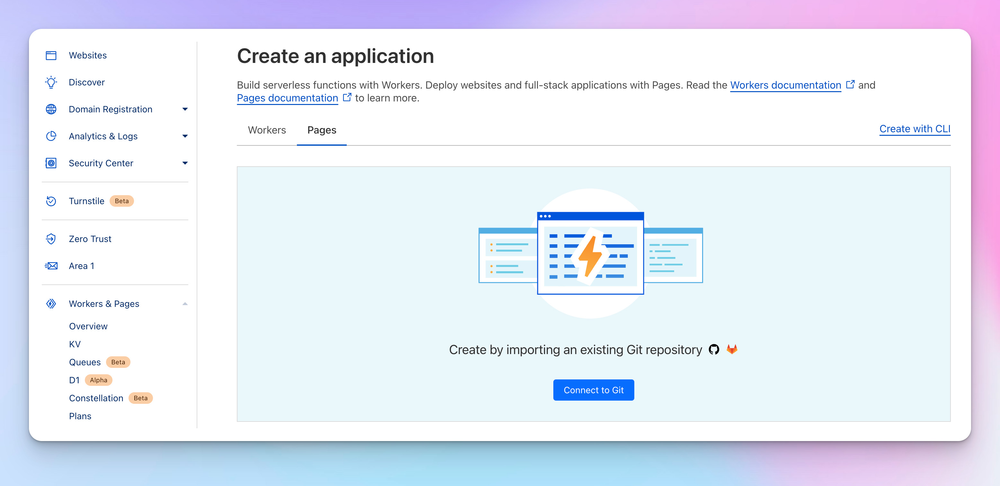
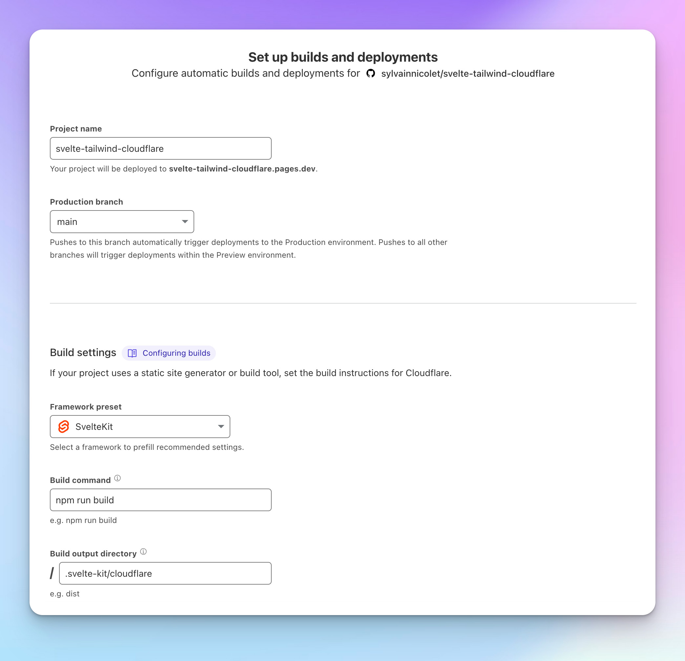
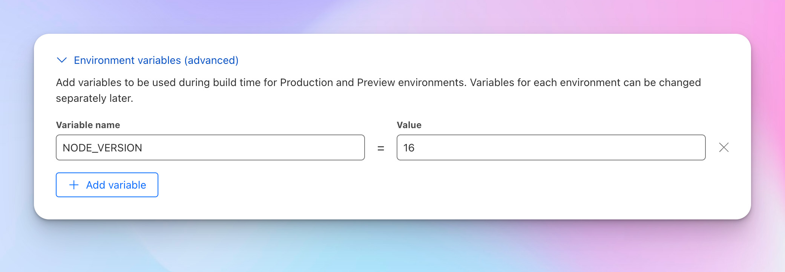

# How to to setup Svelte, TailwindCSS, DaisyUI and deploy to Cloudflare

Welcome to this small tutorial on how to setup SvelteKit, TailwindCSS, DaisyUI and deploy to Cloudflare.


## Prerequisites
- NodeJS (https://nodejs.org/en/)
- PNPM (https://pnpm.io/installation)
- Git (https://git-scm.com/downloads)
- Github Account (https://github.com/signup)
- Cloudflare Account (https://dash.cloudflare.com/sign-up)

## Create a new SvelteKit project
```bash
pnpm create svelte@latest your-app
```

You will be guided through the setup process. Choose whatever you need.
After the installation, navigate into your project folder.
```bash
cd your-app
```
Install all dependencies.
```bash
pnpm install
```
Finally, start the development server.
```bash
pnpm run dev --open
```

## Install TailwindCSS and DaisyUI
Install TailwindCSS and DaisyUI.
```bash
pnpm add -D tailwindcss postcss autoprefixer daisyui
```

Create a TailwindCSS configuration file.
```bash
pnpx tailwindcss init -p
```

In your `svelte.config.js` file, if it not already done, import `vitePreprocess` to enable processing as PostCSS.
```js
import adapter from '@sveltejs/adapter-auto';
import { vitePreprocess } from '@sveltejs/kit/vite';

const config = {
	preprocess: vitePreprocess(),

	kit: {
		adapter: adapter()
	}
};

export default config;
```

Update your `tailwind.config.js` file to include the DaisyUI plugin and include the paths to all of your template files.
```js
export default {
  content: ['./src/**/*.{html,js,svelte,ts}'],
  theme: {
    extend: {},
  },
  plugins: [require('daisyui')],
  daisyui: {
    themes: ["light", "dark"],
  },
}
```

Create a `./src/app.css` file and add the @tailwind directives.
```css
@tailwind base;
@tailwind components;
@tailwind utilities;
```

Import the `./src/app.css` file in your `./src/routes/+layout.svelte` file.
```html
<script>
  import '../app.css';
</script>
```

Now you can use TailwindCSS and DaisyUI in your SvelteKit project!

## Deploy to Cloudflare

### Use the Cloudflare adapter
Install the `@sveltejs/adapter-cloudflare` package.
```bash
pnpm add -D @sveltejs/adapter-cloudflare
```

Update your `svelte.config.js` file to use the Cloudflare adapter.
```js
import adapter from '@sveltejs/adapter-cloudflare';
import { vitePreprocess } from '@sveltejs/kit/vite';

const config = {
	preprocess: vitePreprocess(),

	kit: {
		adapter: adapter()
	}
};

export default config;
```

### Setup a Github repository

Create a new repository on Github and follow the instructions to push your local repository to Github.

### Setup a Cloudflare Pages project

Create a new project on Cloudflare Pages and follow the instructions to connect your Github repository.



Set up the build settings.



Don't forget to set the `NODE_VERSION` environment variable to `16`.



Finally, click on the `Save and Deploy` button.


## Conclusion

That's it! You have now a SvelteKit project with TailwindCSS, DaisyUI and deployed to Cloudflare Pages!